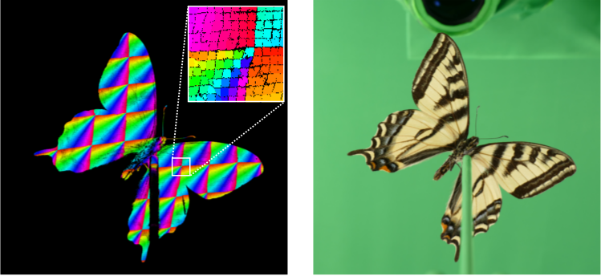
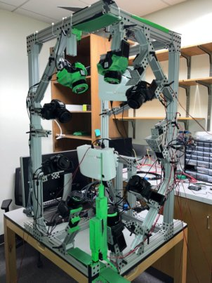
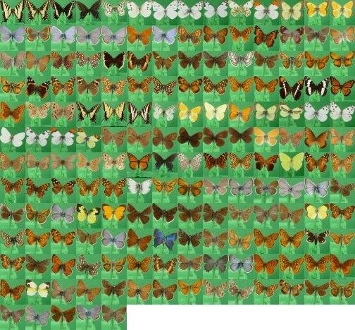
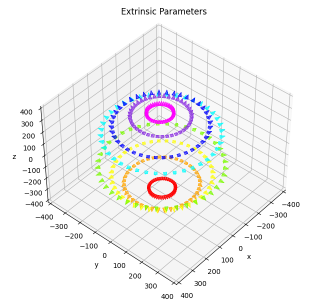

# The FineView Dataset: A 3D Scanned Multi-view Object Dataset of Fine-grained Category Instances


<p float="left">
  
  
  
</p>

This is the official repository for our WACV 2025 paper [[URL](https://openaccess.thecvf.com/content/WACV2025/html/Onda_The_FineView_DatasetA_3D_Scanned_Multi-View_Object_Dataset_of_Fine-Grained_WACV_2025_paper.html)].

## Dataset
<p float="left">
  
  
  
</p>

| Images | Species | Camera pose | Camera view |
| :---: | :----: | :----: | :----: |
|  68,160 | 173 | 320 | Sphere |

- crop_undistort (Original resolution multiview 2D RGB images. This is cropped and corrected for lens distortion)
- crop_mask_undistort (Masked image of crop_undistort)
- crop_undistort_8 (Resized images to 1/8 of crop_undistort)
- crop_mask_undistort_8 (Resized masked images to 1/8 of crop_mask_undistort)

## Download

We've provided a [bash script](https://github.com/byu-vision/fineview/blob/main/download.sh) to download the data. The download process requires ~500 GB of disk space. Run the download script:

```
bash download.sh
```
If you want 1/8 resized version of our dataset, Here is a [bash script](https://github.com/byu-vision/fineview/blob/main/download_8.sh) to download the resized data. This download process requires ~10 GB of disk space.

```
bash download_8.sh
```

## 3D reconstruction

We provide camera parameters (camera_parameters.h5) and correspondence point coordinates (correspondence_undistort/SPECIE_NAME/correspondence_coordinate.h5). Run following command for 3D reconstruction (3D point cloud):

```
python -m venv /path/to/new/virtual/environment
source /path/to/new/virtual/environment/bin/activate
pip install opencv-python numpy pillow h5py open3d
python 3d_reconstruction.py --base_path /The folder path where you download dataset -id SPECIES_number (1-213)
```

## Citation
```
@InProceedings{Onda_2025_WACV,
    author    = {Onda, Suguru and Farrell, Ryan},
    title     = {The FineView Dataset:A 3D Scanned Multi-View Object Dataset of Fine-Grained Category Instances},
    booktitle = {Proceedings of the Winter Conference on Applications of Computer Vision (WACV)},
    month     = {February},
    year      = {2025},
    pages     = {5623-5634}
}
```
